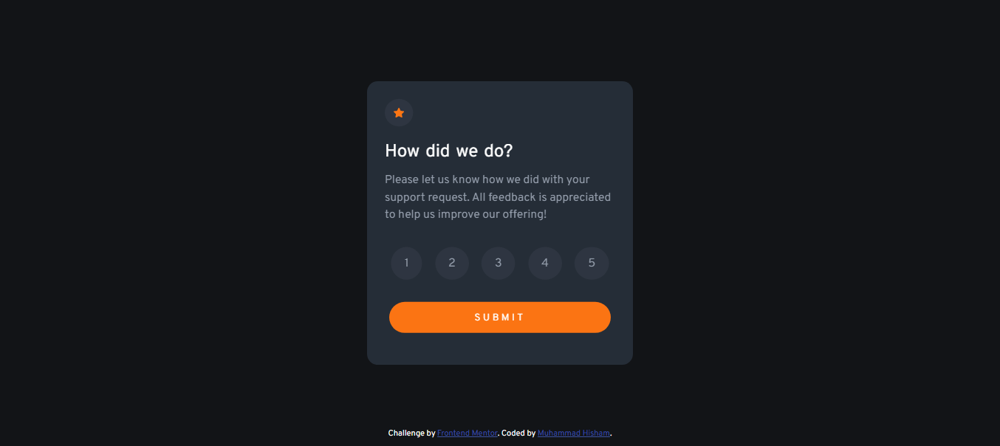

# Frontend Mentor - Interactive rating component solution

This is a solution to the [Interactive rating component challenge on Frontend Mentor](https://www.frontendmentor.io/challenges/interactive-rating-component-koxpeBUmI). Frontend Mentor challenges help you improve your coding skills by building realistic projects. 

## Table of contents

- [Overview](#overview)
  - [The challenge](#the-challenge)
  - [Screenshot](#screenshot)
  - [Links](#links)
- [My process](#my-process)
  - [Built with](#built-with)
  - [What I learned](#what-i-learned)
  - [Useful resources](#useful-resources)
- [Author](#author)


## Overview

### The challenge

Users should be able to:

- View the optimal layout for the app depending on their device's screen size
- See hover states for all interactive elements on the page
- Select and submit a number rating
- See the "Thank you" card state after submitting a rating

### Screenshot



### Links

- Live Site URL: [Add live site URL here](https://your-live-site-url.com)

## My process

### Built with

- Semantic HTML5 markup
- CSS custom properties
- Flexbox
- CSS Grid
- Mobile-first workflow
- JavaScript

### What I learned
    < I learned how to hidden the back of content when rotating using **backface-visibility** property and how to use **add** or **remove** class in JS >

code snippets:

```css
.selector {
    backface-visibility: hidden;
}
```
```js
element.onclick = function () {
    element.classList.add("class-name");
}
```


### Useful resources

- [backface-visibility](https://css-tricks.com/almanac/properties/b/backface-visibility/) - This helped me for understanding backface visibility


## Author

- Frontend Mentor - [@mohamedhesham221](https://www.frontendmentor.io/profile/mohamedhesham221)
- Linkedin - [Muhammad Hisham](https://www.linkedin.com/in/muhammad-hisham-23544b253/)
